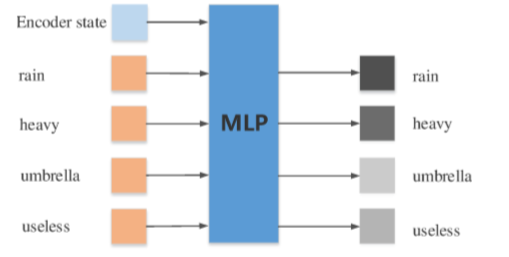

## 
Chat More: Deepening and Widening the Chatting Topic via A Deep Model

---

**1. 研究背景是什么？**

    Dialog system:
        1) task-oriented: vertical domains
        2) non-task-oriented: open-domain topics

    Implement methods:
        1) Rule-based: restrict diversity
        2) Retrieval-based: depend repository
        3) Generation-based: more flexible
            a) Single-turn: neglect historical conversation
            b) Multi-turn
    
The past decade has witnessed the boom of human-machine interactions, particularly via dialog systems. Dialog systems have been widely used in a variety of applications, spanning from entertainment and knowledge sharing, to customer services. Dialog systems can be divided into task-oriented and non-task-oriented categories. The former studies vertical domains. The latter studies open-domain topics. Implement methods mainly includes rule-based, retrieval-based and generation-based methods. To be more specific, the rule-based methods restrict diversity, the retrieval-based methods depend repository, the generation-based methods are more flexible. The generation-based methods can divide into single-turn and multi-turn models. Where, single-turn models neglect the context of conversation. Multi-turn generation-based methods are the best and the hardest.

**2. 在上述背景下研究什么问题？**

    Response generation in open-domain multi-turn dialog systems

    Person A: There is a heavy rain today.
    Person B: The umbrella is totally useless.
    Person A: The rain is really heavy. I got wet in the afternoon and caught a cold at night.
    Person B: You should take some hot tea and get a good sleep.

In this paper, authors study the task of response generation in open-domain multi-turn dialog systems. In this paper, authors study the task of response generation in open-domain multi-turn dialog systems. This shows the topic penetration.
This shows the topic extension. The topic is deepened and widened.

**3. 针对这个问题，已有研究有什么不足？**
    
    1) Without elaborated distinct, incorporates noises
    2) No more attractive and meaningful
    3) Dull response

The first, the majority of prior efforts consider all the phrases in the entire context without elaborated distinction, which indeed incorporates noises and may thus hurt the desired performance. The second, Fewer researchers thus far have addressed the issue that making the conversation to be more attractive and meaningful. The last, current generation-based systems frequently generate dull responses, which are not informative or meaningless. For example, I don’t know.

**4. 解决这些问题有什么挑战？**
    
    1) How to identify the relevant words to effectively guide the response generation?
    2) How to avoid dull responses and generate responses that are not only relevant but also capable of deepening and widening the dialog topics?
    3) How to construct a large-scale dataset for generation-based models?

**5. 本文有哪些创新点？**

    1) Study the context-aware dialog systems
    2) Deepen and widen the chatting topic

**6. 本文的模型？**

To deepen and widen the chatting topics, this paper present a scheme to explore the keywords in a dialog as shown in the picture. The scheme first segments the utterances and extracts the keywords from the context. After that, the model inputs the context and its keywords into three parallel channels, namely, global, wide and deep channels. These channels respectively encode the context into an embedding vector, predict wider keywords, and select deeper keywords based on the context and its keywords. Ultimately, the model adopts an attention mechanism to weigh the context and keywords before feeding them into the RNN decoder that is used to generate a response.

Let’s detail each component of this scheme.

**1) Keyword Extraction**

    TF-IDF:
    a) Retain nouns, verbs and adjectives, Remove other words
    b) A session as a document
    c) A word as a term

This part, the authors apply TF-IDF to extract keywords from the context.
They removed the stop words and only retained nouns, verbs, and adjectives in corpus.
They consider a session as a document and a word as a term to calculate the TF-IDF value of each word.
They finally chose top 20 keywords from each session.

**2) Global Channel**

        GRU: encode the given context into a vector

**3) Wide Channel**

        Attention-based RNN: predict keywords to extend topics

**4) Deep Channel**

    A MLP model: choose the useful keywords to deepen the topic of interest

**5) Decoder**

    Attention-based RNN

**6) Loss Function**

**7. 本文做出了哪些贡献？**

    1) Separate the topic-related keywords from the irrelevant ones, avoid dull responses
    2) Hybrid RNN and DNN model to deepen and widen the chatting topic firstly
    3) Construct a dataset of multi-turn dialogs in the open domain and release the data, code and parameters

**8. 我们何去何从，如何进一步改进**

    shed light on the logical and semantic consistency between the responses and the historical contexts

