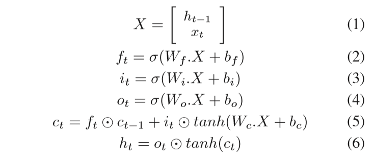
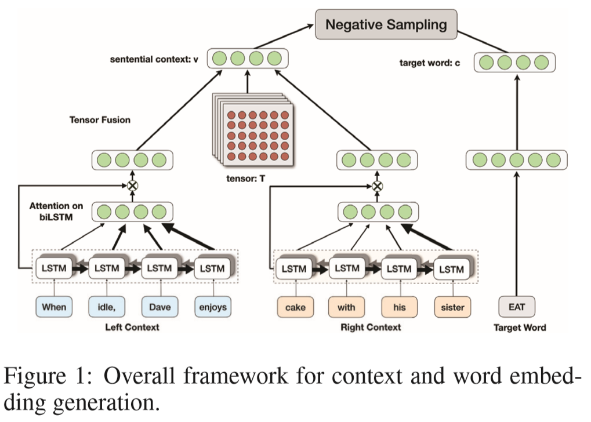
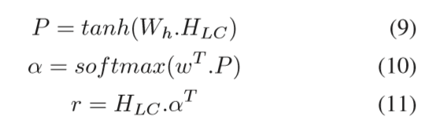

# SenticNet 5: 借助上下文嵌入信息为情感分析发现概念级别的原语
---

# 摘要

随着近期深度学习的发展，人工智能研究取得了新的活力和突出。 尽管机器学习在振兴许多研究领域（如计算机视觉，语音识别和医学诊断）方面取得了成功，但我们还没有看到自然语言理解方面令人瞩目的进展。 这种无与伦比的期望背后的原因之一是，尽管自底向上的方法对于模式识别是可行的，但推理和理解通常需要自上而下的方法。 在这项工作中，我们将次符号和符号联系起来，以自动发现来自文本的概念原语，并将它们与常识概念和命名实体连接在一个用于情感分析的新的三层知识表示中。 具体而言，我们使用循环神经网络通过词法替换来推断原语，并将它们用于通过多维度量化来接近常见和常见的知识。

# 简介

最近，人工智能已成为每个人嘴上的首字母缩写。 尽管没有人知道何时会发生所谓的AI革命，但AI淘金热在过去几年中变得越来越激烈。 今天大部分被认为是AI的实际上都是次符号AI，即机器学习：一种用于探索大量数据的非常强大的工具，例如根据它们进行预测，建议和分类。 然而，机器学习有三大问题，即：

1. 依赖性：它需要（很多）训练数据并且是依赖于域的;
2. 一致性：不同的训练或调整导致不同的结果;
3. 透明性：推理过程是无法理解的（黑盒算法）。

在自然语言处理（NLP）的背景下，这些问题尤其重要，因为与其他领域不同，它们阻止AI实现类人的表现。 为此，人工智能研究人员需要弥合统计自然语言处理和许多其他需要理解人类语言的学科之间的差距，如语言学，常识推理和情感计算。

他们将不得不开发自上而下和自底向上的NLP方法：自上而下的是，他们应该利用符号模型（如语义网络）来编码意义; 自下而上，因为他们应该使用子符号方法（例如，神经网络）从数据推断语法模式。 耦合符号和子符号AI是在从NLP到自然语言理解的路径上前进的关键。 实际上，仅依靠机器学习对于基于过去的经验做出“良好猜测”是非常有用的，因为子符号方法仅对相关性进行编码并且其决策过程仅仅是概率性的。 然而，自然语言理解需要的不仅仅是这些。 要用诺姆乔姆斯基的话来说，“你不会通过大量的数据获得科学的发现，把它们扔进一台计算机并对它们进行统计分析：那不是你理解事物的方式，你必须有理论上的见解”。

在这项工作中，我们提出了一系列符号和子符号AI技术来进行情感分析，这是一个NLP问题，引起了对科学界，对许多激动人心的开放挑战以及商业世界的兴趣从营销和财务预测中获得显着的好处（Cambria et al。2017）。特别是，我们使用长期短期记忆（LSTM）网络（Hochreiter和Schmidhuber1997）通过词法替换发现动词 - 名词基元，并因此为情感分析构建了一个新的三层知识表示，称为SenticNet 5。 SenticNet 5编码通常与现实世界的对象，行为，事件和人物相关的外延和内涵信息。它使用关键词和词语共现词来盲目放弃，而是依赖于与常识概念相关的隐含意义。 SenticNet 5优于纯粹的句法技术，可以通过分析不明确表达情感的多字表达式来检测细微表达的情绪，而是与这样做的概念相关。

本文的其余部分组织如下：首先，我们介绍情感分析领域的相关工作，并解释概念原语对此任务的重要性; 其次，我们详细描述如何发现原语，以及如何将它们与概念和实体联系起来; 最后，我们提出了几个基准数据集的实验结果，并提供结论性意见。

# 相关工作

情绪分析系统可以大致分为基于知识和统计的系统。尽管知识库的使用最初比较流行以用于文本中情感极性的识别，但最近情感分析研究人员已经越来越多地使用基于统计学的方法，特别关注监督统计方法。 庞等人。 （Pang，Lee和Vaithyanathan 2002）通过比较电影评论数据集上不同机器学习算法的表现，开创了这一趋势，并获得了极端检测的82％的准确性。

Socher等人最近的一种方法。 （Socher et al。2013b）利用递推神经张量网络（NTN）获得了85％的准确率。 Yu和Hatzivassiloglou（Yu和Hatzivassiloglou 2003）使用语义方向来确定句子层面的极性。 Melville等人（Melville，Gryc和Lawrence2009）开发了利用词类关联信息进行依赖于领域的情感分析的框架。

更近期的研究利用微博文本或Twitter特定功能（如表情图标，主题标签，URL，@符号，大小写和扩展）来增强对推文的情感分析。 Tang等人 （Tang等人2014a）使用卷积神经网络（CNN）获得用于推文中经常使用的单词的词嵌入，并且Dos Santos等人 （dos Santos和Gatti 2014）在短文中采用了深度CNN进行情绪检测。 最近的方法还着重于基于情感语料库开发词语嵌入（Tangetal.2014b）。 这些词向量包括比正则词向量更多的情感线索，并且对情绪识别（Poria et al。2017），讽刺检测（Poria et al。2016）和方面提取（Poria，Cambria和Gelbukh 2016）等任务产生更好的结果。

依靠大型语义知识库，这种方法远离了对关键词和词语共现计数的盲目使用，而是依赖于与自然语言概念相关的隐含特征。 与纯粹的句法技巧不同，基于概念的方法也能够检测以微妙方式表达的情感; 例如通过分析没有明确传达任何情绪的概念，但是这些概念隐含地与其他概念相关联。

概念包概念模型可以表示与自然语言相关的语义，比包含词更好。 在后者中，事实上，像丑陋或悲伤的微笑这样的概念将被分成两个单独的单词，破坏了输入句子的语义和极性。

# 概念原语的重要性

概念层次情感分析和概念包模型的主要局限在于，他们无法实现有意义概念的全面覆盖，即实际上有意义的多词表达的完整列表（例如，动词 - 名词对）。 语义分析和n-gram模型采用自下而上的方法，通过从原始数据中自动提取概念来解决此问题。 由此产生的多词表达式由于自然语言的丰富性和模糊性而容易出错。

克服这一障碍的一个更有效的方法是采用自顶向下的方法，将与语义相关的概念（如蒙克面包和浆果面条）概括成概念性原语，例如吃食物。通常，大多数概念记录可以通过 知识基础：动词概念，如摄取，啜食，蒙克都是用它们的概念性原始EAT来表示的，而像面食，面条，牛排这样的名词概念被他们的本体父母食物所取代。 这种泛化背后的思想是，有一组有意义的心理基元和一组有关它们相互作用的精神组合的原则。

尝试对事物，事件和人物进行分类，找出他们共同的模式和形式，这是人类本性所固有的。关联两个实体最直观的方式之一就是通过它们的相似性。根据格式塔理论（Smith 1988），相似性是指导人类对世界的看法的六个原则之一。相似性是一种使一个人或另一个人与另一个人相似并且“相似”意味着具有共同特征的品质。基于颜色，形状，大小和纹理等事物，可以将物体视为相似的方法很多。如果我们远离单纯的视觉刺激，我们可以应用相同的原则基于共享语义特征来定义概念之间的相似性。以前的SenticNet版本利用这一原则将自然语言概念分成相似的情感属性（Cambria et al。2015）。然而，找到一组类似的概念并不能确保覆盖所有可能的多词表达式的语义影响。

在这项工作中，我们利用子符号AI自动发现可以更好地概括SenticNet常识知识的概念原语。 这种泛化是受到不同理论基础上的不同理论的启发（Schank 1972; Jackendoff 1976; Wierzbicka1996），也是关于知识表示的理论研究（Minsky 1975; Rumelhart and Ortony 1977）。 所有这些理论都声称分解方法是探索概念化所必需的。

以同样的方式，物理科学家通过将事物分解成越来越小的部分来理解事物，通过将意义分解为更小的部分来进行对概念化的科学研究。 显然，这种分解不可能永远持续下去：在某个时刻，我们必须找到不能进一步分解的语义原子。这是概念结构的层次; 心理表征，通过构建意义的原始概念元素来编码基本理解和常识。

在SenticNet中，这种“分解”转化为多词表达的泛化，表达一组特定的情绪，因此具有特定的极性。 这种泛化过程背后的动机是，有无数种方式可以用自然语言表达相同的概念，并且具有所有可能概念影响的全面清单几乎是不可能的。 尽管词法化如缀合和变化可以通过词形解析来解决，但是语义方面的影响如同义词或语义相关概念的使用需要通过概念依赖和类比推理来解决。

因为概念依赖理论和许多其他象征性方法的主要理由被弃用于次符号技术，所以需要花费大量的时间和精力来提出全面的规则。 子符号技术不需要花费很多时间和精力进行分类，但它们是数据依赖性和函数性黑盒子方法（即我们不知道如何以及为什么产生分类标签）。 在这项工作中，利用递归神经网络的泛化能力自动发现情感分析的概念基元。

这不仅有助于扩展SenticNet（100,000个概念）的覆盖范围，而且也很有趣，因为它代表了在情感分析环境中合并符号和子符号AI的首次努力之一。 特别是，我们利用从文本中进行极性检测的自下而上的数据驱动推理（词嵌入和递归神经网络）和自顶向下的知识表示（概念性基元和语义网络）的集合。

# 原语的发现

句子S可以表示为一个单词序列，即S = [w1，w2，...，wn]，其中n是句子中单词的数量。 句子可以分成若干部分，前缀：[w1，... wi-1]形成左上下文句子，其中l个单词，后缀：[wi + 1，... wn]形成右上下文句子 r词。 这里，c = wi是目标词。 

在第一步中，我们用低维分布表示来表示这些词，称为词嵌入。 具体而言，我们使用由（Mikolovet al.2013）提供的预先训练的300维word2vec嵌入，该嵌入是在30亿字的Google新闻语料库上训练的。 我们的上下文句子和目标概念现在可以表示为一个单词向量序列，从而构成左上下文的矩阵，L∈Rdw×l，R∈Rdw×r和C∈Rdw×1（dw = 300），右 上下文和目标词。

- 双向LSTM

为了从这些子句中提取上下文特征，我们独立地在L和C上使用biLSTM模型。 假设我们将句子中第t个单词的单词向量表示为xt，则LSTM转换可以按照下式执行：

其中d是隐含表示的维数，Wi，Wf，Wo，Wc∈Rd×（d + dw），bi，bf，bo∈Rd是训练期间要学习的参数（表1）。 σ是sigmoid函数和？ 是元素乘法。 d和k的最佳值分别设置为300和100（基于验证数据集上的实验结果）。我们使用了10个负面样本。

当采用biLSTM时，这些操作被应用在序列的两个方向上，并且每个时步的输出被合并以形成总体表示。 因此，在使用biLSTM的foreachsentencematrix中，我们得到了递归表示特征矩阵HLC∈R

- 句子的上下文表示

为了让我们的模型能够关注在提供上下文中很重要的子句，我们在我们的上下文句子的biLSTM之上加入了一个注意模块。 注意模块由一个具有一个隐藏层和一个softmax输出的扩展神经网络组成（图1）。 它生成一个向量，它提供了对应于句子之间的下层相关性的权重。 下面，我们描述应用在左上下文句子上的注意表达。

HLC可以表示为[ht]的序列，其中t∈[1,1]。 让A表示这句话的注意网络。 A的关注机制如下产生一个关注权向量α和一个加权隐藏表示r：

