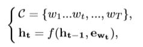
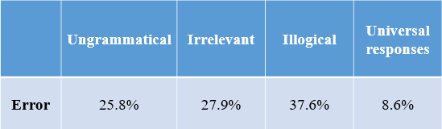

# 多聊点：利用深度模型深化和拓宽聊天主题
---

## 摘要

在过去的十年中，人机交互的热潮，特别是通过对话系统而出现。在本文中，我们研究开放域多回合对话系统中响应生成的任务。许多研究工作都致力于构建智能对话系统，但很少有研究阐明在会话会话中加深或拓宽聊天主题，这将吸引用户进行更多的讨论。为此，本文提出了一种由全球，广泛和深度三个渠道组成的新型深层方案。全局通道在给定的上下文中对完整的历史信息进行编码，广泛的通道使用基于注意力的递归神经网络来预测可能不会出现在历史上下文中的关键字，而深层通道训练多层感知器模型以选择一些关键字进行深入的讨论。之后，我们的方案将这三个通道的输出结合起来以产生所需的响应。为了证明我们的模型，我们进行了大量实验，将我们的模型与两个数据集上的几个最先进的基线进行比较：一个是我们自己构建的，另一个是公共基准数据集。实验结果表明，我们的模型通过扩大或深化感兴趣的主题产生了良好的表现。

## 1 介绍

对话系统也称为会话代理，已广泛用于各种应用，从娱乐和知识共享到客户服务。粗略地说，对话系统可以分为面向任务和非面向任务的类别。以前的研究[27]旨在完成垂直领域的任务;而后者研究[21,30]的目标是与开放领域主题的人聊天。这两种类型的对话系统可以通过基于规则，检索或基于生成的方法来实现。更具体地说，基于规则的方法定义的启发式模板以某种方式限制了期望对话系统的多样性。至于基于检索的检索[29,31,32]，它们很大程度上依赖于存档的存储库。相比之下，基于生成的方法能够产生更多灵活的响应，通常是通过训练序列到序列的网络来处理一篇文章作为输入，并将响应当作输出。尽管意义重大，但基于单轮生成的模型[21,30]忽略了在以下聊天中发挥关键作用的历史对话环境。为了缓解这个问题，已经设计了多回合对话系统[18-20,22]，其中背景信息通过多种方式被表示为密集且连续的向量。例如，分层递归编码器 - 解码器模型（HRED）[19]使用词级和话语级递归神经网络分层编码上下文。尽管最近几年利用背景信息的多回合对话系统取得了成功，但由于以下问题，它们仍然会因次佳表现而存在：1）根据我们对1,000次对话会的用户研究，不超过45.2％的短语上下文直接有助于响应生成。尽管如此，大多数在先事件都考虑了整个语境中的所有短语，但没有详细的区分，这确实包含了噪音，因此可能会损害理想的表现。 2）我们的发现表明，在一次会议中，人们往往倾向于加深或拓宽他们正在聊天的主题，导致对话更具吸引力和更有意义，如表1所示。然而，迄今为止很少有研究人员已经解决了这个问题。甚至更糟糕的是，目前基于生成的对话系统经常产生沉闷的反应（比如“我不知道”），这些反应不具有信息量或无意义[19,22]。鉴于此，高度期望能够利用相关情境信息并产生信息反馈以进行更深入和更广泛对话的对话系统。

然而，由于以下事实，解决多回合对话系统中的上述问题并不是微不足道的：1）长时间背景中不相关的短语可能会压倒相关的短语，这会误导模型并增加其计算负担。 因此，如何识别相关词汇来有效引导反应的产生是一个未解决的问题。 2）产生沉闷的反应或谈论同一主题而没有更深入或更广泛是无聊的，通常会让人们很快结束谈话。 因此，我们如何才能避免沉闷的回应，并产生不仅相关而且能够深化和扩大对话主题的回应，这些挑战都存在。 3）大规模数据集对于确保基于生成模型的稳健性至关重要。 然而，发布的多回合对话数据集既可以是垂直域，也可以是小规模的[8,9,15,29]。

为了解决上述问题，我们开发了一个深度广泛的神经网络，名为DAWnet，如图1所示，由三条并行通道组成，即全局通道，深度通道和宽通道。 DAWnet能够加深和拓宽聊天主题。更具体地说，DAWnet对话语进行分割，全局通道首先将给定的上下文转换为编码完整历史信息的嵌入向量。 DAWnet然后从上下文中提取所有关键字。在所收集的关键字和上下文嵌入之上，宽信道利用基于注意力的递归神经网络（RNN）来预测更宽的关键字。更广泛的关键字意味着关键字可能不会出现在给定的上下文中，并有助于拓宽主题。至于深度通道，它训练一个多层感知器（MLP）模型来选择一些深层次的关键字进行深入讨论，其中输入是上下文嵌入向量和收集的关键字。更深的关键字指的是上下文中支持加深当前话题的关键字。整个方案在解码有意义的响应之前最终将上下文编码器的输出，深信道中的所选关键字以及宽信道中的预测关键字输入到选择器中。装备有关注机构的选择器判断三个输入的贡献。

三项投入的归属。 为了培训DAWnet并评估其在提高连贯性，信息性和生成反应的多样性方面的表现，我们在开放领域建立了多回合对话框数据集，名为新浪微博对话语料库。 它涵盖了我们日常对话中的丰富话题。 这些对话是从新浪微博1收集的，中国最受欢迎的社交媒体网站之一，超过30％的互联网用户使用这些对话。 为了彻底证明DAWnet的合理性，我们还在基准数据集DailyDialog [6]上评估了DAWnet。 我们比较了DAWnet和两个数据集上的几个最新的基线。 实验结果表明，DAWnet在多回合对话系统中具有良好的性能。

我们的工作贡献是三倍。
- DAWnet能够将与主题相关的关键字与不相关的关键字分开，并使用选定的相关关键字生成有意义的响应。 这是避免沉闷反应的关键步骤。 
- 据我们所知，这是通过混合RNN和DNN模型在多回合对话系统中加深和拓宽聊天主题的第一项工作，该模型鼓励用户进行更多讨论。 
- 我们在开放域中构建了多回合对话框的数据集。 另外，我们发布了数据，代码和参与的参数，以方便本领域的其他研究人员2。 本文的其余部分安排如下。 在第2节中，我们简要回顾了相关的工作。 第3节介绍了我们提出的模型的细节。 我们在第4节进行实验和分析结果，接下来是第5节的结论和未来工作。

## 2 相关工作

由于可用数据集的增加和深度神经网络技术的快速发展，对话系统已经得到了实质性的发展。传统的对话系统通常依赖手工建立的模板和规则[26]，阻碍了对其他领域的泛化能力。近年来，已经提出了更多的数据驱动的对话系统。在开放领域，它们大致分为两大类：基于检索和基于生成的方法。前面的方法[11-13,25,29]通常通过用各种匹配算法对响应候选者进行排序来选择合适的响应。与单圈对话系统[24,25]相比，多圈对话系统[29,31,32]已被探索，以利用近年来的对话情境。虽然基于检索的模型可以从存储库中检索到丰富而多样化的响应，但它们必须满足以下前提条件：所选响应应该是预先存在的。因此，性能受限于存储库的规模和质量。后一代系统在统计机器翻译的启发下，用数据驱动方法模拟了一篇文章与一篇文章之间的映射关系。一开始，研究人员利用编码器 - 解码器框架[16,21]来解决单圈对话系统的任务。随着机器翻译[23]中的注意机制[1]变得越来越流行，它被更频繁地结合到编码器 - 解码器框架[30]中以提高性能。后来，更多的研究工作致力于多回合对话系统中的对话历史建模。动态上下文生成模型[22]对上下文进行编码并将其张贴到固定长度的向量中，并将它们馈送到递归神经网络语言模型中以生成响应。 HRED用两个RNN对上下文的层次结构进行建模：一个在单词级别，另一个在话语级别。基于HRED，VHRED [20]将潜在随机变量表示为模型，MrRNNs [18]通过对序列上的联合概率进行因式分解来模拟多个并行序列。交互式对话上下文语言模型通过使用两个并行的RNN来跟踪对话中讲话者之间的交互。 Li等人[5]通过整合神经SEQ2SEQ系统[1]和深度强化学习的优势来模拟两个代理之间的对话。 Mei等人[10]提出了基于RNN的对话模型配备了动态关注机制，以增加关注对话历史的范围。

上述基于生成模型的共同问题是，由于一般词汇的频率高，它们倾向于产生沉闷的反应。为了提高响应的质量，已经提出了各种方法。姚等人。 [33]增加了一个RNN来模拟SEQ2SEQ模型中意图过程的动态。 Li等人[4]使用最大互信息作为神经模型中的目标函数来缓解沉闷的反应。 Topicaware序列到序列模型[30]考虑主题词在响应生成中的位置，其中主题词来自Twitter LDA模型。然而，使用Twitter LDA获取这样的主题词是具有挑战性的，因为帖子非常短，开放域对话中的主题很少。根据我们对新浪微博对话语料库300万次会话的统计，有超过2500万个独特单词，其中一半以上出现少于5次。考虑到稀疏性问题，很难根据短文确定相关主题词。

- 我们研究了上下文感知对话系统，因为对话是连续的，因此响应生成必须考虑对话的历史。
- 由于将合适的主题分配到精简文章并从主题中选择有意义的单词非常具有挑战性，因此我们可以预测广泛频道可能不会出现在上下文中的更广泛的关键字，并使用深度频道选择更具体的关键字， 帮助模型加深和拓宽聊天主题。

## 3 模型

为了加深和拓宽聊天主题，我们提出了一个方案来探索对话框中的关键字，如图1所示。该方案首先分割话语并从上下文中提取关键字。 之后，模型将上下文及其关键字输入三个并行通道，即全局通道，广泛通道和深度通道。 这些通道分别将上下文编码为嵌入向量，预测更广泛的关键字，并根据上下文及其关键字选择更深的关键字。 最终，该模型在将它们馈送到用于生成响应的RNN解码器之前，采用关注机制对上下文和关键字进行权衡。 在本节中，我们将详细介绍此方案的每个组成部分。

### 3.1 关键词提取

我们应用词频 - 逆文档频率（称为TF-IDF）[3,17,28]，从上下文中提取关键词。 在诸如信息检索，文本挖掘和用户建模等领域，TF-IDF主要用于衡量单词在文档中的重要性。 它假定一个单词的重要性与它在文档中出现的时间成正比，并且通常由整个语料库中单词的频率来确定。 我们删除了停用词，并在DailyDialog [6]和新浪微博对话语料库中仅保留了名词，动词和形容词。 然后，我们将会话视为文档和词作为术语来计算每个单词的TF-IDF值。 我们最终从每个会话中选择了前20个关键字。

### 3.2 全局通道

在这个频道中，我们利用配备门控循环单元（GRU）的RNN将给定的上下文编码成矢量。 鉴于包含几个话语的上下文，我们将其视为一系列令牌。 RNN编码器然后如下计算上下文向量，

其中上下文C表示T个令牌的序列，ewt是指第t个令牌的嵌入向量，ht是RN在时间t的隐藏状态，f是非线性函数。 在我们的工作中，GRU网络被参数化为

其中xt是输入矢量，ht是输出矢量，z是更新门矢量，r是复位门矢量，Wz，Wr，Ws，Uz，Ur和Us是参数矩阵，◦表示单元乘法，σg 和σh分别是sigmoid和tanh激活函数。

### 3.3 宽度通道

在这个频道中，我们训练一个基于关注的RNN模型来预测关键词来扩展主题。 给定矢量c，用于关键词预测的RNN由编码器的最后一个隐藏状态初始化并通过更新

其中ekp t-1是预测关键词序列中时间t-1关键词的嵌入向量，ct是从关注机制获取的时间t的向量，[ekp t-1，ct]是连接 这两个向量st是tN时刻RNN的隐藏状态。 时间t处的矢量ct由下式计算

其中ekc i∈Rde是第i个上下文关键词的嵌入向量，Wt∈Rdh×de是将关键词的嵌入向量投影到具有dh维的高维空间的变换矩阵，mi是投影获得的向量，dh 是隐藏状态的大小，T是上下文令牌的数量，M是上下文关键字的数量。 权重系数αti被定义为

其中η由一个以tanh作为激活函数的MLP模型实现。 RNN解码器通过投影层计算每个步骤处的预测关键字的概率，

pk（kp t | C，kc 1，...，kc M，kp 1，...，kp t-1）= ok t·σs（Wkst + bk），其中dk v是关键字词汇的大小 ，Wk∈Rdk v×dh和bk∈Rdk v是投影层的参数，σs表示softmax函数，kp t是第i个预测关键词，ok t是kp t的单热矢量。 投影层的输入是解码器的隐藏状态，它输出所有关键字的概率分布。 形式上，产生所有预测关键字p（kp 1，...，kp N | C，kc 1，...，kc M）的概率被表示为

在这个频道中，解码器基本上预测了一系列更宽的关键字，这些关键字将被送入解码器进行响应生成。

### 3.4 深度通道

深度频道的目标是从背景中选择有用的关键词来加深感兴趣的话题。 采用RELU作为激活函数的MLP模型来计算上下文关键字的权重。 输入是编码器的最后隐藏状态和上下文关键字的嵌入向量。 输出由给出

其中l0是通过连接编码器的最后隐藏状态和M个上下文关键字的嵌入向量计算出来的，q∈RM表示上下文关键字的权重，并且MLP模型由四层神经元实现，其具有作为激活函数的 输出层中的前三层和乙状结肠。 所选关键字的向量由更新

此通道中选定关键字的向量将在解码器中用于响应生成。

### 3.5 解码器

如图3所示，用于响应生成的RNN解码器与用于关键词预测的RNN解码器类似，但矢量c不同，

其中N是预测关键字的数量，ekp i
是第i个预测关键字的嵌入向量，Wt∈Rdh×de是一个变换矩阵，与宽信道的相同，ni通过投影ekp i获得。 给定编码器和向量c的最后隐藏状态，解码器RNN逐个令牌地预测目标响应，

其中Wy∈Rdy v×dh和∈Rdy v是将隐藏状态投影到词汇表中所有单词的概率分布的投影层的参数，dy v是词汇的大小，ks i表示第i个选定的 关键字，yt表示响应中的第t个标记，σs是softmax函数，oy t是yt的单向量。 产生响应的概率

其中L是响应中令牌的数量。

### 3.6 损失函数

在形式上，让我们将Θ表示为整个模型的参数集，并且从D = {（Ci，Kc i，Kp i，Ks i，Ri）} i = I i = 1估计Θ，其中Ci，Kc i ，Kp i，Ks i和Ri分别表示上下文，上下文关键字，预测关键字，选定关键字和响应。 我们通过最小化以下目标函数l来优化Θ，

其中β1和β2是目标函数中的两个参数，l0，l1和l2分别对应于响应解码器的目标函数，宽信道和深信道。 同时，我们不得不提及u∈{0,1}和ui = 1，当且仅当ui∈Ks

## 4 实验

### 4.1 数据集

为了验证DAWnet的性能，我们对DAWnet的两个开放域多回合对话数据集DailyDialog3 [6]和新浪微博对话语料库进行了培训和评估。

DailyDialog是一个人类写作的数据集，涵盖了我们日常生活中的各种主题，如金融，政治到旅游。 该数据集包含13,118个多回合对话会话。 每个对话的平均转换次数，每个对话的令牌数和每个话语的令牌数分别为7.9,114.7和14.6。 我们提取关键字并最终构建了13,118个样本，其中11,118个用于培训，1,000个用于验证，另外1,000个用于测试。

除了DailyDialog的英文数据集外，我们还构建了一个具有代表性的中文数据库，即新浪微博对话语料库。特别是，我们抓住了来自中国最受欢迎的社交媒体网站之一新浪微博的两个人之间的大量对话，这些网站被超过30％的互联网用户使用，覆盖了我们日常生活中丰富的现实主题。原始数据包含约2000万个会话，每个会话包含两个人之间的许多后回应对。此后，我们选择满足以下规则的会议：1）会议中的轮次超过三次。 2）响应是有意义的，至少有两个关键字。这些关键字是指那些TF-IDF值不小于给定阈值的关键字。选择之后，我们通过去除嘈杂的词语并将表情符号转换为相应的词语来预处理会话。最终，我们有一个总共包含1,587,119个会话的数据集。每个对话的平均转换和令牌分别是3.71和42.17。在新浪微博会话语料库中，我们使用公共工具4提取中文分词，提取关键词，然后随机选择1,407,119个样本进行培训，9,000个样本进行验证，9,000个进行测试。

在这两个数据集中，最后一个话语被用作响应，其余话语被视为上下文。 响应中的关键字分为两类：预测关键字和所选关键字。 所选关键字直接与当前主题相关，并出现在上下文中; 而预测的与主题相关，但不一定在上下文中出现。

### 4.2 实验设置

#### 4.2.1 超参

在我们的实验中，我们从上下文中提取了至少五个关键字，并从每个对话会话的响应中提取了两个关键字。 词嵌入的维度被设置为100，并且嵌入矩阵被随机地初始化。 DailyDialog中的词汇量为20,000，新浪微博会话语料库中的词汇量为40,000。 词汇表中的所有单词都映射到特殊标记UNK。 RNN具有4层GRU结构，每层有1024个隐藏单元。 宽通道中的MLP模型分别在前三层包含1,024,512,128个节点。 我们使用Adam [2]来优化目标函数，并且学习率被初始化为0.001，其在训练中动态地改变。 在目标函数l中，我们最终从{β1，β2}∈{{0.25,0.25}，{0.5,0.5}，{0.75,0.75}，{1， 1}}基于回答的困惑。 在培训中，我们使用验证集来提早停止。

#### 4.2.2 评价指标

为了测量DAWnet的性能，我们遵循现有的研究并采用了几种标准度量标准：困惑（PPL），BLEU [14]和基于多样性的Distinct-1 [4]。 就这些指标而言，我们将DAWnet与基线进行了比较。 具体而言，PPL描述了概率模型如何很好地预测目标样本。 BLEU量化生成的响应与参考响应之间的n-gram重叠。 在某种程度上，Distinct-1反映了反应的多样性。

PPL被广泛用于概率模型以量化其性能。 形式上，在语言模型中，给定一个话语S = {w1，w2，...，wN}，PPL被定义为

其中q（wi | w1，w2，...，wi-1）表示在语言模型中生成单词wi的概率。 当PPL较小时，模型表现更好。

BLEU是机器翻译的指标。 形式上，BLEU-N分数由以下公式计算

其中r和c分别表示参考响应和候选参考响应的长度，pn表示修改的ngram精度[14]，N表示使用长度为N的n-gram和wn = 1 N。 BLEU值越高，参考响应和候选响应越相似。

为了验证响应的多样性，我们采用了Li等人[4]设计的Distinct-1度量。 Distinct-1计算为生成的响应中生成的令牌总数中缩放的不同unigrams的数量。 更高的Distinct-1值意味着反应更加多样化。

#### 4.2.3 基准算法

- SEQ2SEQ +注意：基于注意的SEQ2SEQ [1]在许多NLP任务中表现出了良好的性能，并且广泛用作基于生成对话系统的基准。 以下表示为SEQ2SEQ。 
- HRED：HRED [19]能够通过对分层RNN中的上下文进行建模，在长时间内捕获有用的信息。 它已经在多回合对话系统中证明了它的有效性。 
- VHRED：基于HRED，VHRED也是一种基于神经网络的生成模型，但具有潜在随机变量。 在以前的工作[20]中，VHRED表现更好，并有助于产生长期反应。

### 4.3 整体性能

我们将DAWnet与几个标准度量标准的所有基线进行了比较。图5绘制了所有模型的收敛性。结果总结在表2中。我们还在DAWnet和每个基线之间进行了茫然的t检验。我们观察到，所有的pvlaues都小于0.05，表明我们的模型在统计上显着。从表2中，我们可以观察到以下几点：1）DAWnet在两个数据集上实现最低困惑度。有利的表现证明，预测和选择的关键字实际上提供了更多的信息来利用模型; 2）较高的BLEU值表明反应更接近实际情况。在新浪微博对话语料库中，VHRED，DAWnet和特别是HRED在BLEU方面表现不佳。事实上，刘等人。 [7]报道了BLEU与人体评估之间的弱相关性。我们还发现HRED，VHRED和DAWnet的许多反应是合理的，但与实际情况相差甚远; 3）DAWnet的Distinct-1值远远高于所有的基线，这表明DAWnet可以产生更多不同的单词，因此反应更加多样化。广泛和深度渠道中丰富的关键字确保响应的多样性。

### 4.4 主观评价

除了客观评价外，我们还进行了一次主观评价。特别是，我们从两个数据集中分别随机抽取500个样本。对于每个样本，我们使用DAWnet和三条基线来生成响应。因此，我们获得了3,000个三胞胎（样品，响应1，响应2），其中一个响应由DAWnet产生，另一个响应由基线产生。然后，我们邀请了三名本科生按照以下规则对每个三元组进行注释：1）注释者屏蔽了生成响应的系统标识符; 2）每个注释者需要独立评分胜利，损失和平局（胜利：反应1更好;损失：反应2更好;领带：他们同样好或不好）; 3）标注前，注释人员接受少量样本的培训，要求他们综合考虑四个因素：相关性，逻辑一致性，流畅性和信息性; 4）采用多数投票策略来判断哪一个更好。值得注意的是，如果三位注释者评价三种不同的选项，我们将这个三重数字计为“平局”。表3总结了主观评估的结果。 kappa分数表明注释者在判决中达成了一个公平的协议。

从表3可以看出：1）DAWnet优于基线。 在三条基线中，SEQ2SEQ表现最差，HRED表现最好。 我们分析了基线的不利情况。 SEQ2SEQ生成的响应不是有效的或逻辑的。 HRED往往会产生一般性和较少信息性的反应，例如“好”和“确定”。 VHRED产生的反应通常很长且信息丰富，但其中大部分与上下文无关。 而且2）超过45％的三胞胎被标记为“领带”。 通过检查这些样本，我们发现其中大多数不合逻辑或不相关。

### 4.5 讨论

#### 4.5.1 实例研究

表4列出了由DAWnet和基线生成的一些响应。从表4，我们可以观察到一些发现：1）在第一个样本中，HRED的反应是合理的，但与“我自由”的背景相冲突。 SEQ2SEQ和VHRED的反应很有效，但它们与上下文无关。 DAWnet预测关键词“where”和“airport”，并生成“机场在哪里？”作为回应，这是合理的; 2）第二个样本中VHRED的反应解释了我们先前的结论，即VHRED倾向于产生长时间的信息反馈，但与上下文无关。在这种情况下，DAWnet预测相关的关键字“发热”，这有助于产生良好的响应。它表明，广泛的渠道运作良好，因此DAWnet能够拓宽话题; 3）DAWnet在第三个样本中预测关键字“help”，并通过本质生成“谢谢”作为回应。这意味着它预测“我会打电话给失物招领办公室”。这是一种帮助，广泛的渠道起着举足轻重的作用; 4）第四种情况是DAWnet测试样本中典型且有争议的例子。 DAWnet的反应似乎转移了话题，但实际上在连贯性和语法上存在一些问题。这是因为它可能受到预测关键字的很大影响，并且它们主导了解码器的响应生成。

#### 4.5.2 模型切除

为了检查广泛和深度渠道的有效性，我们每次都排除了一个渠道，并验证了绩效。我们分别通过去除宽通道或深通道来进行两个单独的实验。从表5中的结果中我们观察到：1）当我们移除宽频道或深频道时，性能下降，表明宽频道和深频道对于改善性能是不可或缺的; 2）当我们移除深度频道时，Distinct-1值增加。只有广泛渠道的模型倾向于产生一些相关但不同的词。受这些词的影响，模型倾向于转移话题，这可以解释这一现象。但是，如果宽频道主导解码器产生响应，则整个会话期间的一致性和相关性可能变差。表4中的第四种情况显示了这个问题的一个例子。因此，广泛和深度渠道之间的平衡至关重要。

#### 4.5.3 错误分析

为了进一步提高DAWnet的性能，我们选择了在主观评估过程中判断的不好的样本，并分析了为什么他们在比较中更差。坏的情况分为四类：不合语言的反应，不相关的反应，不合逻辑的反应和普遍的反应。不合语法的反应是指那些没有语言错误和语法错误的反应。如果答复很有效但与上下文无关，我们会将其称为不相关的答复。不合逻辑的反应意味着它是有效的和相关的，但它与自身或逻辑中给定的上下文相冲突。普遍的反应是不太丰富和普遍的，例如“我不知道”或“好”。表6给出了四种不利案例的解释。对于具体的定量分析，不合语法，不相关，不合逻辑和普遍反应分别占据25.8％，27.9％，37.6％和8.6％。结果表明：1）DAWnet产生的通用反应较少; 2）虽然背景，预测和选择的关键词提供了丰富的对话历史信息，但该模型仍然难以完美地产生有效和相关的反应。 3）逻辑问题在坏的情况下是一个特别严重的问题。事实上，逻辑问题是神经语言生成模型中最具挑战性的问题之一。

分析启示我们在未来的工作中进一步改进模型。

## 5 总结和展望

在这项工作中，我们研究开放域多回合对话系统中响应生成的任务。我们提出了一个新的深度计划来加深和扩大话题中的话题。该方案首先对话语进行分割并从上下文中提取关键词。随后，将上下文和关键字输入三个并行通道，即全局通道，广泛通道和深度通道。全局通道将上下文编码为嵌入向量，宽通道预测更宽的关键字，深通道从上下文关键字中选择更深的关键字。最终，该模型在将它们馈送到用于生成响应的RNN解码器之前，采用关注机制对上下文和关键字进行权衡。对两个数据集进行了广泛的实验。通过分析结果，我们可以得出以下结论：1）广泛和深度的渠道鼓励生成反应的多样性和信息性; 2）宽频道能够转移话题，但如果更广泛的关键字占据解码器以产生响应，则与上下文的相关性可能下降。因此，深度渠道在该计划中至关重要。

作为未来的工作，我们将阐明回应与历史背景之间的逻辑和语义一致性。

