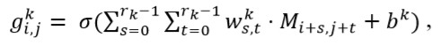

# 通过基于CNN相似矩阵的注意力RNN处理Freebase上的问答
---

## 摘要

随着知识库（Knowledge Base，KB）的快速增长，近年来对基于知识库的问答（即KBQA）也在引起了人们的高度关注。大多数现有的KBQA方法都遵循所谓**先编码再比较的框架**。他们将问题和知识库事实映射到一个共同的嵌入空间，其中问题向量和事实向量之间的相似性可以方便地计算出来。然而，这不可避免地会**丢失原始单词交互信息**。为了保留更多的原始信息，我们提出了一种**基于相似矩阵的卷积神经网络模型（AR-SMCNN）**，该模型能够利用RNN和CNN两者的优势来捕获综合分层信息。我们使用RNN通过序列建模本质来**捕获语义级关联**，并使用注意机制同时**跟踪实体和关系**。同时，我们使用基于CNN的相似矩阵和双向池，利用CNN建模数据间空间相关性的强度来提取**字面级词语交互匹配**。此外，我们开发了一种新的**实体检测启发式扩展方法**，大大降低了噪声的影响。我们的方法在准确性和效率上都超越了SimpleQuestion基准测试的先进水平。

## 1 介绍

近年来，已经出现了YAGO [8]，Freebase [9]，NELL [10]和DBpedia [11]等多种大型通用知识库，人们正在寻求有效途径来获取他们丰富的知识。有几种用于查询知识库的语言，但它们不是非常用户友好的 - 用户需要熟悉语言语法和知识库的词汇表。或者，对知识库（KBQA）的问题回答允许用户直接使用自然语言来查询知识库，并且最近引起了很多关注。尽管KBQA给最终用户带来了便利，但由于结构化知识库和非结构化自然语言问题的差异，它具有挑战性。在本文中，我们主要关注KBQA中最常见的知识库中可以用单一事实回答的问题[23,25]。回答单关系问题是处理其他更复杂和多关系问题的基础，而这类任务还远远没有得到解决，因为有大量解释同一问题的解释，使得问题映射到KB中的特定三元组很困难。

我们的工作主要基于Freebase [9]，其中三元组以主体关系对象的形式出现。 我们分两步处理问题回答任务：（1）提取问题的主题，对应三元组主体; （2）预测最能描述主题和答案的关系。 只要主体和关系的预测都是正确的，答案是肯定的。 该过程如图1所示。

KBQA的大多数现有深度学习方法都遵循编码器比较框架（即[1，4-6，15]），其中首先使用n-gram问题文本搜索Freebase以生成一组候选KB事实，并且然后通过深度神经网络将问题和KB元素（实体名称和关系名称）映射到共同的嵌入空间。问题和KB事实之间的相关性通过两个嵌入向量之间的相似度来计算。这些方法主要存在三个不足：（1）编码后的嵌入向量只包含语义信息，因此它们之间相似度的计算只能捕捉到高层次的相关性并丢失原有的词语交互信息; （2）实体候选集合由名称为问题子串的所有实体组成，引入了大量的噪声; （3）[4,5]中实体名称的编码属于字符级别，因此实体匹配模型只能检测文本表面匹配，不能区分同名的实体。

针对这些问题，我们提出了一种基于相似矩阵的卷积神经网络（AR-SMCNN）模型和一种新的实体检测方法。 AR-SMCNN利用卷积神经网络（CNN）和递归神经网络（RNN）的互补优势来捕获综合的分层匹配信息，其中CNN擅长提取变异特征中的位置并处理空间相关数据，并且RNN是好的 在序列建模单元中处理时间信号（见Yin等人[22]）。

图1的底部显示了我们的AR-SMCNN模型的两个不同输入。左边部分是细心的RNN，它通过一个标准的编码器 - 比较结构分别对问题和关系进行编码来捕获语义级别的关联。这里我们将Freebase的关系分为两部分，分别代表主题类型和真实关系（基于KB关系的前两部分“film.film”与主题类型相同）的观察。注意机制可以在这两个部分的问题上捕捉到每个单词的不同贡献。同时，关注主体类型可以区分同名的实体，从而隐含地解决了实体检测中剩余的问题。如图1所示，实体候选m.01kbm91和m.0gxnslj具有相同的名称，但具有不同的类型。我们可以排除类型与“电影”类型不同的实体，这个问题就是关于这个问题的。此外，这种做法也有助于缓解OOV问题，因为它将关系类别的数量减少了大约一半。

右边部分是基于相似矩阵的CNN，它检测问题和关系词之间的字面级匹配。 受Pang等人启发。 [12]，我们构造一个相似度矩阵，其条目表示问题词和关系词之间的相似度。 在此基础上，利用双向最大池CNN分别从问题和关系的角度提取词语交互匹配。 这是基于观察到知识库关系经常与问题中的几个关键字或改写的标记相对应。 相似矩阵将这些相应的关系作为交互结构进行制定，并且其上的卷积层捕捉丰富的匹配模式。

另外，我们还提出了一种实体检测方法。 我们提出了一种启发式扩展方法来获取实体候选并省略实体匹配神经网络。 这种简单而有效的方法在没有附加训练模型的情况下达到了相同的效果，并且还消除了一些无意的子问题无关实体引入的噪音。

我们的系统在SimpleQuestion数据集[3]上实现了最新的结果。 我们还将以前的实体检测任务和关系检测任务分别进行了比较，两者都具有竞争效果。 总之，本文的主要贡献是我们提出了一种新的方法来处理单关系KBQA，其中包括（1）一个注重RNN和基于相似矩阵的CNN（AR-SMCNN）关系检测模型，它捕获语义 （2）和实体检测的启发式扩展方法，它是高效和有效的。

## 2 相关工作

### 2.1 基于KB的简单关系的问答

在[23]中首先通过PARALEX数据库对知识库Reverb [24]进行了关于KB的单关系问题的回答。 该领域的一个重要研究线索研究了语义分析方法，将问题转化为结构化的KB查询[19-21]，这需要复杂的NLP管线。

另一系列研究通过深度学习动力相似匹配来解决问题。其核心思想是用编码器 - 比较框架学习问题和知识库元素的语义表示，使得正确的支持证据将成为学习向量空间中问题的最近邻居[6]。这些方法的主要区别在于编码器模型（RNN或CNN）和输入粒度（字级或字符级）。 Dai et al。 [6]通过合理的概率解释来研究一种基于关系RNN的方法。尹等人。 [4]将关系拆分为单词序列，使用CNN并提出一个周密的最大池方法来改进模型。 Lukovnikov等人。 [1]也使用词级关系表示，但他们使用的网络是BiGRU。为了对关系进行更细致的划分，Golub和He [5]提出了一种基于注意力增强架构的字符级方法，其中注意力被引入以更好地处理更长的序列。 Yih等人[14]在问题和关系方面使用字符三元组作为输入。 Yu et al。 [15]集中在关系的两个粒度：字级和关系级。他们提出了一种由残差学习增强的分层RNN，它检测不同的抽象层次。

我们的方法与第二线研究密切相关，但我们构建了一个不遵循传统编码器比较框架的附加CNN。

### 2.2 NLP中CNN的应用

CNN在自然语言处理（NLP）中的应用近来取得了很大的进展。 [29,30]首先在自然语言处理领域中应用CNN，在句子分类任务，情感预测任务等方面获得竞争结果。尹等人。 [22]比较RNN和CNN得出的结论是CNN擅长提取不同特征的位置并处理空间相关的数据。 Wang等人[32]综合了从RNN和CNN提取语言信息的不同方面的优点，为文本建模。庞等人。文献[12]提出了一种文本匹配方法，该方法引用了CNN在图像识别中的成功。该模型可以自动捕获重要的匹配模式，如不同级别的单元，n元和n元。在他们的启发下，我们构造了一个问题和关系的相似矩阵，并利用CNN来捕捉原始单词交互匹配。我们的整个模型利用了RNN和CNN的互补优势，并且能够捕捉到问题与关系之间的全面关联。

### 2.3 实体检测

对于实体检测，以前的作品使用n-gram的问题单词来搜索名称与问题具有共同子串的实体，如[5,1,3]。然后他们使用神经网络来捕捉问题和这些实体名称之间的表面匹配，以及其他语法指示符（例如编辑距离，LCCS（最长连续公共子序列））。 Golub和He [5]分别使用字符级LSTM对问题和实体名称进行编码，而Yin et al。 [4]使用字符级的CNN来编码它们; Lukovnikov等人。 [1]用词级和字符级对问题进行编码。此外，为了缩小搜索范围，Yin et al。 [4]和戴等人。 [6]提前使用额外的BiLSTM-CRF标记模型来检测实体文本跨度。虽然这有所改进，但在搜索过程中访问知识库还是需要很长时间，并且会引入大量噪音。与他们不同，我们提出了一种启发式扩展方法来获取实体候选，无需构建额外的神经网络，这可以显着降低复杂性并提高效率。它还消除了一些具有常见子字符串问题的不相关实体引入的噪声。

为了区分具有相同名称的实体，Dai等人 [6]和Lukovnikov等。 [1]使用实体类型作为附加信息。 [6]将其视为一个多分类问题并训练一个模型将问题分类为实体类型，同时[1]将这些信息添加到匹配模型中，并使用字符级实体名称和字级类型的连接对实体进行编码。 其他先前的作品忽略了这个问题，在他们的模型中什么都不做。 我们观察到Freebase中关系的定义隐含地包含了实体类型信息，因此我们将这项工作留给关系检测，并使用注意机制来关注这部分。

## 3 方法

在下文中，我们描述了我们的KBQA方法，它由两部分组成：（1）用于查找主题实体的实体检测方法和（2）用于捕获问题和候选关系之间相关性的关系检测模型。

### 3.1 任务定义

我们首先描述基于我们工作的知识库。 Freebase是一个结构化的知识库，实体之间通过预定义的关系进行关联。 表示为（s，r，o）的三元组（主体，关系，对象）描述了一个事实。

整个过程如图1所示。我们假设单关系问题可以通过用单一主题和关系论证查询知识库来回答。因此，只需要元组（s，r）来匹配问题。只要s和r的预测都是正确的，我们就可以直接得到答案（这显然对应于o）。根据上述假设，问题可以通过以下两个步骤来解决：

1. 确定问题涉及的Freebase中的候选实体。给定一个问题Q，我们需要找出实体提及X，那么名称或别名与实体提及相同的所有实体将组成实体候选E.现在E中的所有实体都具有相同的实体名称，因为我们无法区分他们现在。

2. 所有与E中实体相关的关系都被视为候选关系，命名为R.我们将问题转换为模式P，它是通过用<e>替换问题中的提及而创建的。为了找出与问题真正相关的关系，我们将P与R中的每个关系进行比较并对它们进行评分，然后将得分最高的关系作为最终结果。

### 3.2 实体检测

实体检测过程如图2所示。给定一个问题Q，我们训练一个双向LSTM网络[26]，就像一个顺序标签任务，它可以被看作是一个二进制分类问题，可以预测句子中的每个单词是否属于实体提到。然后，我们得到一组具有正标签的词，表示为C.这些词可能不是连续的，然后我们使用以下启发式方法来获得实体提及X.

1. 将C中的相邻单词组合（忽略间隙<= 1）组成一个子串S.如果有多个子串，则保持最长的一个。

2. 找出Freebase中名称或别名完全等于S的所有实体。这些实体形成实体候选者E，S被视为实体提及。如果没有匹配S，继续步骤（3）。

3. 基于S中的单词最有可能构成实体提及X的事实，因此基于S有很大的可能产生X.因此，我们以S为中心并在其周围找到X.具体来说，我们扩展或缩小最多2个字围绕S获得S'，1并使用S'来找到相应的实体。一旦找到匹配，就确定E和X.

4. 如果找不到任何匹配，则我们使用S中的每个单词来搜索名称中包含单词的实体。我们将具有最长公共子序列的实体作为实体候选E保留，并且公共子序列将为X.这一步与以前的方法类似，但这里发生的可能性小于0.2％。

（1）的目的是把分散的词汇结合起来，这是假设如果有一个词预测为负面标签，但其邻居是正面的，则必须预测它是错误的。 在此基础上，以下操作将改善召回。 实体候选人中的主题是通过他们的出度来排序的，这是他们连接的关系总数。

### 3.3 关系检测

给定一个问题模式P，对于关系候选者R池中的每个关系we，我们计算一个表示它们之间相关性的匹配分数𝑆（𝑃，𝑟𝑘）。 最后的预测是𝑟𝑘

我们通过AR-SMCNN模型考虑P和𝑟𝑘之间的两个相关性粒度，即语义级和文字级匹配。 在下面的章节中，我们将分别介绍模型的两个组成部分，理论和实现。 图3显示了整体结构。

#### 3.3.1 语言级

为了捕捉问题和关系之间的语义级匹配，我们构建了一个细心的RNN作为编码器 - 比较框架。 我们发现Freebase中的关系包含两个方面的信息，一个与主体类型相同，另一个描述主体与客体之间的关系。 即“哪个语言是电影<in>”的问题模式对应于<film.film.language>的关系。 关系“film.film”的前两部分代表主体的类型，最后一部分“语言”代表主体与“德语”答案之间的真正关系。 这两部分对应不同的问题单词，因此问题中的每个单词对问题编码应该有不同的贡献。 基于这种观察，我们分别对两部分关系进行编码，并在问题编码器上使用注意机制来匹配它们两者。

##### 3.3.1.1 关系编码

对于R中的每个关系，我们将它们分成两部分，如上所述，并将每个部分转换为其可训练的嵌入（随机初始化），以获得它们的向量表示𝑟1和𝑟2。

##### 3.3.1.2 问题对的编码

将问题中的每个单词转换为嵌入{1，...，}的单词，然后嵌入到双向GRU [27]网络中以获得隐藏表示H 1：𝐿= [ℎ1;⋯;ℎ𝐿]（每个矢量 ℎ𝑖是在时间i）前向/后向表示之间的连接）。 关系的每个部分都对问题给予不同的关注，并决定如何表示问题。 注意的程度被用作问题中每个单词的权重。 因此，对于关系表示𝑟𝑖，其相应的问题模式表示𝑝𝑖计算如下：

其中∈∈{1，2}，α𝑖𝑗表示关系方面𝑟𝑖中问题中第j个单词的关注权重。 L是问题的长度。 令𝑟𝑖的维数为m，dimension的维数为，，则W和v是用𝑊∈𝑅𝑐×（𝑚+𝑛）学习的参数，𝑣∈𝑅1×𝑐（其中c是一个超参数）。

##### 3.3.1.3 相似性度量

现在我们有问题模式和关系的表示，它们的相似性由下面的等式计算

这里的操作是两个向量的点积。 我们还尝试了其他方法来计算它们之间的相互作用，例如余弦，双线性，曼哈顿距离和GESD [2]，但它们没有得到改善，而且在训练过程中稍慢。 这表明在这项任务中，简单的点积就足够了。

#### 3.3.2 文字级

当考虑字面级别的关联时，我们将其视为文本匹配问题。 我们发现问题和关系中的一些单词（或短语）具有不同的表达（或命令），即使它们表达相同的含义。 就像图4所示的例子一样，单词对（音乐，音乐）（类型，流派）（工作室，公司）都表示类似的话题。 编码器比较模型不能捕获这些词交互信息，因为编码器之后的表示仅保留高级语义信息。 受Pang等人启发。 [12]，我们构造一个相似度矩阵，其条目表示问题词和关系词之间的相似性，将其作为利用卷积层来捕获匹配特征的二维图像。 以下描述详细信息。

##### 3.3.2.1 相似矩阵

相似矩阵。 我们构造了一个相似度矩阵M，其中每个元素Mij表示基本的相互作用，即𝑢𝑖和vj（𝑢𝑖和similarityj之间的相似度分别表示第i个和第j个嵌入的问题和关系）：

其中⨂代表一般操作员获得相似性，这里是余弦。 与严格的文本匹配不同，该矩阵可以捕捉具有不同形式或表达的单词的相似性。

卷积层。 典型的卷积核可以提取不同级别的匹配模式，例如字级或短语级匹配（甚至以不同的顺序）。 更具体地说，第k个内核𝑤𝑘扫描整个相似度矩阵M以生成特征映射𝑔𝑘：

其中𝑟𝑘表示第k个内核的大小。 这里我们使用方形内核，并且采用ReLU [16]作为活动函数σ。

从2方向的最大池化层。 我们在特征映射𝑔𝑘的顶部使用两个不同的汇聚内核。 其大小分别为1×𝑑1和𝑑2×1，其中𝑑1和𝑑2分别表示相似度矩阵的宽度和长度：

其关键思想是从问题和关系两个角度保留最大匹配特征，即问题中的每个单词，每个关系单词之间的最大匹配分数，以及关系中的每个单词的最大匹配分数 在每个疑问词中。 这比使用正方形池化内核要好，因为我们更加重视此任务中单个单词的最大匹配分数。

完全连接的层。 MLP（多层感知）用于产生最终特征。 对于每个池化结果采用双层感知器，我们将获得：

其中K表示核的总数，并且[K（𝑖，0）;𝑦（𝑖，𝐾）]是K个池化层输出的拼接，𝑊𝑖是第i个MLP层的权重，σ表示 激活功能，这里是ReLU。

#### 3.3.3 组合

组合。 在两个匹配粒度之后，我们分别从不同方面得到四个特征（𝑧1，𝑧2，𝑧3，𝑧4），其中𝑧1和den2分别表示与主体类型和关系的语义关联性，𝑧3和den4表示从问题和 关系方面。 我们利用线性层学习各自对整体匹配分数的贡献：

上面描述的模型是用排序损失进行训练，以最大化候选池R中金关系and +和其他关系margin-之间的边际：

其中γ是一个常数参数。

## 4 实验

### 4.1 数据集

我们在SimpleQuestion数据集上验证了我们提出的方法。 由Bordes等人发布的SimpleQuestion基准。 [3]提供了一套单一关系问题; 每个问题都伴随着一个基础事实，这是Freebase的三倍。 数据集分为列车（79,590），有效（10,845）和测试（21,687）组。 该基准还提供Freebase的两个子集：FB2M和FB5M。 前者包含2M实体，后者包含500万实体。

### 4.2 实验设置

在实体检测过程中，我们通过将黄金主题映射回文本来生成训练集，以标记每个问题的文本跨度。 更具体地说，对于每个（问题，事实）对，我们将主题的名称（或别名）与问题进行匹配，并将最长的一个作为它的黄金实体文本跨度。

在训练过程中，所有的单词嵌入都使用预训练的GloVe [13]初始化为300维。 关系嵌入随机初始化为150个维度。 BiGRU的隐藏层大小为200，铰链损失余量γ设置为1. CNN通道数为8，内核大小设为3×3。 为了优化，使用Adam [31]以批量大小64的微型批次设置以0.0005的学习率训练参数。在我们的实验中，使用压差来调整BiGRU和CNN，并设置为0.3.2

负采样大小为50，比其他方法小得多（戴等人[6]使用1024）。 我们尝试了其他更大的负面抽样规模，例如75和100，但没有明显的好处。 这表明我们模型的简洁和有效。

## 5 结果

在本节中，我们将在SimpleQustion数据集上展示整体结果，我们将按照所提出的方法进行训练和预测。 另外，我们分别分析实体检测和关系检测的结果，以显示它们的有效性。 我们还通过不同的关系方面将编码过程中的问题单词的注意分布可视化，以显示注意机制如何工作。

### 5.1 总体结果

我们将我们的结果与最近在SimpleQuestion数据集上开发QA模型的六项最新技术成果进行了比较。 这些作品包括Bordes等人的记忆网络方法。 [3]，Golub和He [5]提出的字符级关注增强型编码器 - 解码器方法，Lukovnikov等人提出的基于端到端多级GRU的方法。 [1]，Dai等人的基于单词RNN的方法。 [6]，Yin等人关注CNN的方法。 [4]，以及余等人的层次残差LSTM的方法。[15]。

我们遵循Bordes等人。 [3]将预测的实体 - 关系对与实际情况进行比较。 当且仅当我们选择的实体和我们预测的关系与实际情况相符时，一个问题才被视为正确。 如表1所示，我们的方法在FB2M和FB5M设置上实现了77.9％和76.8％的准确度，分别超过了先前的最新成果0.9％和1.1％。

此外，我们的方法不仅有效，而且有效。 所有的实验都是在配有Nvidia GTX1080 GPU的机器上进行的。 我们的培训流程花费了大约一个小时20个时期，并取得了最佳效果。

### 5.2 实体检测

我们将实体检测结果与几个基线进行比较，其中包括Dai等人的重点修剪方法。 [6] Yin，et al。 [4]，以及Lukovnikov等人的候选生成方法。[1]。 表2显示了前K个实体候选者的回忆（K∈{1,5,10,20,50,100,400}），其中回忆被计算为实体候选者的前K个包含权利的问题的百分比 主体实体。 第一行可以被视为实体检测的准确性。 表3显示了总体召回率，即实体候选人集合包含预期实体的问题的百分比。

正如我们在第3.2节中所解释的，我们的扩展方法直接检测到问题中的实体提及，省略了实体匹配过程[1,3,6]。 因此，它会在一定程度上减少召回。 但另一方面，我们生成的候选人只包含名称相同的实体，这就大大减少了候选人的规模，并且避免了一些不相关的实体产生的噪音，这些实体偶然出现了带有问题的常见子字符串。

表3显示，我们得到95.8％的总体召回率，略低于Yin等人的最新结果96.7％。 [4]，但我们的候选集的平均大小是他们的三分之一。 同时，表2显示，从最高1到最高400，我们的召回率高于[4]和[1]。 它证明我们在更小的候选集中有更多有用的信息，并且正确的实体具有更高的排名。

### 5.3 关系检测

我们在Yin等人发布的数据集上测试我们提出的关系检测模型。[4]。 他们已经用特殊符号<e>代替了实体提及并构建了关系候选者，所以我们有相同的出发点来使这个子任务的比较有意义4。

表4显示关系检测子任务的结果。 基线包括BiCNN [14]，AMPCNN [4]和HR-BiLSTM [15]。 它们都遵循编码器比较框架，首先将问题和关系映射为向量，然后通过向量比较获得语义相似性。 这表明我们的方法超过了Yu等人的最新成果。 [15]，它使用分层残差BiLSTM模型来对单词级别和关系名称级别上的问题和关系进行编码。 我们的AR-SMCNN模型受益于两个关系方面的注意，以及与之前方法不同的单词交互匹配。

进一步进行消融实验来分析我们模型的每个组件的影响。 表4的下半部分显示消融结果。 BiLSTM的结果（第四和第五行）由Yu et at发布。[15]。 “rel_name”表示关系名称，“rel_separated”表示关系分为两部分。 “SimMatrix-CNN”表示基于相似矩阵的CNN模型。 根据实验结果，我们有以下观察。

1）以关系名称作为整体，BiGRU比BiLSTM表现得更好一些（分别为90.3％和88.9％）。在此基础上，将关系分解为两部分并分别编码，结果显着改善（92.0％）。这表明，整个关系的两个方面可能会混淆其语义表示，从而难以在一个向量中保留整体信息。

2）对BiGRU采取注意机制也可以提高性能（0.8％）。它表明，给予不同的问题表示尊重关系的两个方面可以促进捕获匹配信息。

3）单个相似矩阵基CNN的性能与AMPCNN和字级BiLSTM几乎相同。当采用双向池化时，准确率从91.2％提高到91.8％，证明了两个最大池内核的有效性。

4）将这些组件组合在一起导致了很大的改进，达到了93.7％的最佳准确率，这表明细心的RNN和相似矩阵基CNN具有互补性，并且我们的最终模型能够成功地捕获问题和关系之间的综合等级关系。

### 5.4 注意力的有效性

根据第5.3节的结果，关注机制在实现最佳绩效方面起着关键作用。为了更深入地理解其有效性，我们将问题单词问题编码过程中的注意分布可视化（见图5）。

我们可以发现，对于两个关系方面来说，每个问题单词都会学习不同的权重并恰当地捕捉注意力。 即在第一个例子中，关系“music.genre”的一个方面很注意词“音乐”，“流派”和“分类”，而另一方面的艺术家主要关注词“艺术家”。 它表明AR-SMCNN学习问题单词和关系方面之间的合理对应关系。

## 6 总结

在这篇文章中，我们提出了一种基于神经网络的新颖方法来回答大规模知识库中的单关系问题，它利用RNN和CNN的互补强度来捕获语义和文字相关信息。 通过省略实体匹配模型使得模型简单化，所提出的方法实现了有竞争力的结果。 尽管所提出的方法仅限于单关系问题，但这项工作可以作为未来开发更先进的神经QA方法的基础，可以处理更复杂的问题。 在未来的工作中，我们将扩展我们的方法来处理多关系问题，并增加一部分约束检测。 我们还将研究像GraphQuestions [17]，ComplexQuestions [18]和Lc-quad [28]这样的新兴数据集，以处理一般QA的更多特征。

