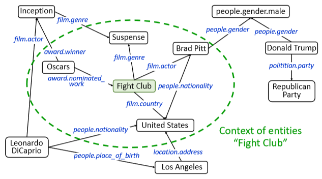
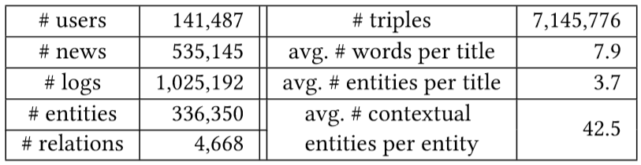

# 基于深度知识感知网络的新闻推荐：DKN
---

## 1. 研究背景是什么？

解决互联网信息过载的问题，帮助用户针推荐其感兴趣的内容并给出个性化的建议

## 2. 在上述背景下研究什么问题？

**基于知识图谱的用户个性新闻推荐。**

**DKN：一种基于内容的用于点击率预测的新闻推荐框架。**

通过知识图谱来提取新闻间的隐知识层面的联系

## 3. 针对这个问题，已有研究有什么不足？

- 基于词汇共现的模型，很难发现这些潜在的知识
- 推荐的结果仅限于简单的模式，并且不能被合理地扩展
- 非个性化的新闻推荐: 模拟新闻的相关性; 学习编辑者的示范.
- 个性化新闻推荐: 新闻热点更新较快, 解决不了冷启动问题

- 基于内容的方法和混合的方法: 基于点击行为预测的贝叶斯方法
- 基于位置的本地情感分析方法
- 上下文赌博机
- 主题模型
- RNN

## 4. 解决这些问题有什么挑战？

- 新闻高度时效性和短时相关性
- 用户对话题敏感性, 数据稀疏性
- 新闻高度浓缩，充满知识和常识

## 5. 本文有哪些创新点？

- 多通道: multi-channel
- 词与实体对齐: word-entity-aligned

## 6. 本文的模型？

**DKN框架图**

### 6.1 知识抽取: Knowledge Distillation

**知识抽取图**

**步骤:**

*输入: 一篇新闻*
*输出: 词向量, 链接实体向量, 上下文实体的向量*

1. 将标题拆成一组词
2. 实体链接(链接不上Padding)
3. 上下文实体抽取(邻接实体)
4. 词嵌入(word2vec), 实体嵌入(TansD)

**实体上下文提取(one-hop)**

### 6.2 知识感知卷积神经网络: KCNN

**词向量, 链接实体向量, 上下文实体的向量在同一个模型里训练的挑战:**
1. 如果直接拼接会打破词与实体的连接关系以及忽略对齐
2. 词向量和实体向量是通过不同的模型训练到的, 不适合直接在同一向量空间运算
3. 词向量和实体向量的最优长度可能不同

**解决方案:**
1. 链接实体向量和上下文实体向量通过非线性变换映射到与词向量同一向量空间
2. 把词向量, 变换后的实体向量, 变换后的上下文实体向量当作三个通道(类似图像的RGB, 达到了三者对齐), 进行卷积运算
3. 最大值池化操作得到一个值
4. 所有过滤器的值拼接在一起

### 6.3 抽取用户兴趣的注意力网络

用户已点击的新闻{$t_1^i, t_2^i, ..., t_{N_i}^i$}对候选待判定新闻$t_j$的影响是不同的, 直接求平均是不合适的

**注意力神经网络图**

**候选新闻$t_j$分别与已点击新闻做拼接求权重--已点新闻对修行新闻的影响**

### 6.4 神经网络计算候选新闻$t_j$的点击概率

## 7. 实验过程及结果怎么样？

- 数据集

- 实验

## 8. 本文做出了哪些贡献？

提出了DKN框架

## 9. 我们何去何从，如何进一步改进

### 9.1 Max-over-time pooling缺点
1. 位置信息丢失
2. 频度信息丢失

**改进:**
- K-max-pooling: 全局Top-k
- Chunk-max-pooling: 局部Top-k
 
