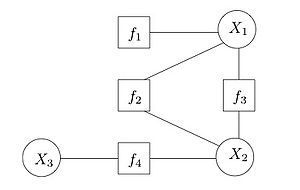

# 因子图模型 Factor Graph Model
---

*不要与图分解混淆*

因子图是表示函数分解的二分图。 在概率论及其应用中，因子图用于表示概率分布函数的分解，从而实现有效的计算，例如通过和积算法计算边际分布。 因子图和和积算法的重要成功案例之一是解码容量接近纠错码，例如LDPC和turbo码。

因子图概括了约束图。 值为0或1的因子称为约束。 约束图是

一个因子图，其中所有因子都是约束。 因子图的最大乘积算法可以被视为用于约束处理的弧一致性算法的概括。

## 1 定义 Definition

因子图是表示函数分解的二分图。给定函数的分解$g(X_{1}, X_{2}, \dots, X_{n})$,

$g(X_1,X_2,\dots,X_n) = \prod_{j=1}^m f_j(S_j),$

其中$ S_j \subseteq \{X_1,X_2,\dots,X_n\},$对应因子图$G=(X,F,E)$由变量顶点$X=\{X_1,X_2,\dots,X_n\},$因子顶点$F=\{f_1,f_2,\dots,f_m\},$和边$E$组成。边缘取决于因子分解，如下所示：因子顶点$f_j$和变量顶点$X_{k}$, 其中$ X_k \in S_j$。该函数被默认假设为实值：$g(X_1,X_2,\dots,X_n) \in \Bbb{R} $。

因子图可以与消息传递算法结合使用，以有效地计算函数的某些特征$g(X_1,X_2,\dots,X_n)$，例如边际分布。

## 2 实例 Examples

考虑如下分解函数:

$$g(X_1,X_2,X_3) = f_1(X_1)f_2(X_1,X_2)f_3(X_1,X_2)f_4(X_2,X_3),$$

上方显示相应的因子图。 观察因子图有一个循环。如果我们将$f_2(X_1,X_2)f_3(X_1,X_2)$合并为单个因子，结果因子图将是一棵树。 这是一个重要的区别，因为消息传递算法通常对树而言是精确的，但对于具有周期的图只是近似的。

## 3 因子图上的信息传递 Message passing on factor graph

因子图上流行的消息传递算法是和积算法，它有效地计算函数各个变量的所有边缘。 特别是，变量$X_{k}$的边际定义为

$$ g_k(X_k) = \sum_{X_{\bar{k}}} g(X_1,X_2,\dots,X_n)
$$

其中符号$X_{\bar{k}}$表示求和除了$X_{k}$之外的所有变量。和积算法的消息在概念上在顶点中计算并沿边传递。来自或来自变量顶点的消息始终是该特定变量的函数。例如，当变量是二进制时，入射到相应顶点的边上的消息可以表示为长度为2的向量：第一个条目是在0中评估的消息，第二个条目是在1中评估的消息。变量属于实数字段，消息可以是任意函数，需要特别注意它们的表示。

在实践中，和积算法用于统计推断，其中$ g(X_1,X_2,\dots,X_n)$是联合分布或联合似然函数，因子分解取决于变量之间的条件独立性。

Hammersley-Clifford定理表明其他概率模型如贝叶斯网络和马尔可夫网络可以表示为因子图;当使用置信传播对这种网络进行推断时，经常使用后一种表示。另一方面，贝叶斯网络更适合生成模型，因为它们可以直接表示模型的因果关系。

