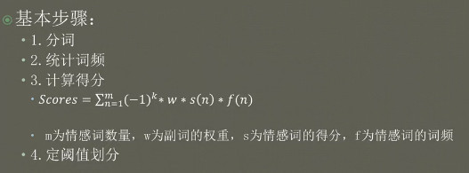
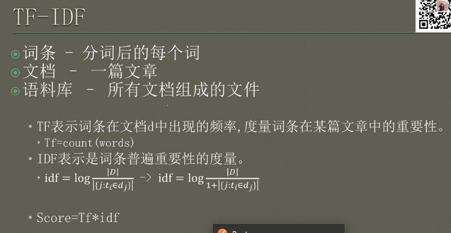
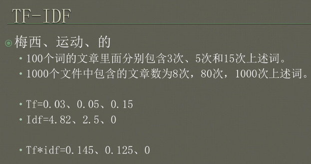
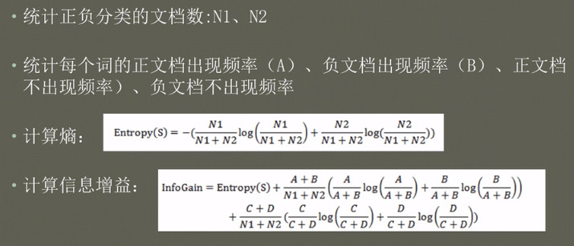
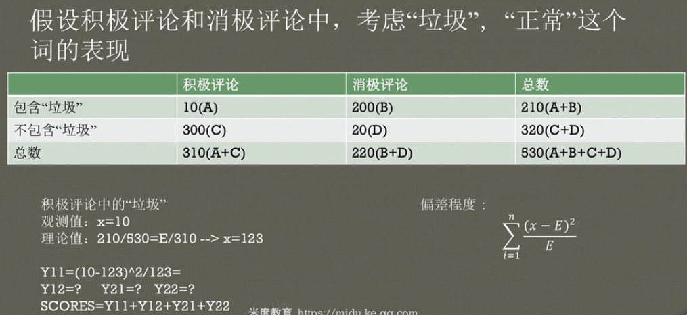

# 情感分析
---

## 1 什么是情感分析

## 2 情感分析用途

- 用户评价打分
- 媒体监控
- 营销
- 股票
- 政治倾向分析

## 3 情感分析的方法预览

- 基于词典的情感分析
- 基于机器学习的情感分析
    - TF-IDF
    - 信息增益
    - 卡方检验
- 基于深度学习的情感分析
    - Word2vec
    - fasttext
    - LSTM, CNN, RNN

### 4 基于词典的情感分析

#### 4.1 

- 情感词
    - 正面情感词-非常好
    - 负面情感词-太烂了
- 程度词
    - 太
    - 特别
- 否定词
    - 不
    - 没有

#### 4.2 基本步骤

    1. 分词
    2. 统计词频
    3. 计算得分
    4. 定阈值划分

#### 4.3 缺点

没有更好的了：
更不好：
剧情好，特效棒，演员敬业。。。我实在编不下去了

### 5 基于机器学习的情感分析

- 特征提取
- 特征选择
- 算法分类

**关键是特征：特征决定了学习的上限，算法只是接近这个上限**

**算法**

- SVM
- 朴素贝叶斯
- LR
- 决策树
- 随机森林

这里只讲 **特征提取**

**语料向量化**

**One-hot编码**

- 维度爆炸
- 计算时间增加
- 稀疏性

**特征提取**

- TF-IDF
- 信息增益
- 卡方检验

#### 5.1 TF-IDF

**文本特征提取的步骤**

1. 分词
2. 计算每个词的TF-IDF
3. 积极评论中挑选topK个词,消极评论中挑选topK个词组成词典
4. 分别提出2K个词的词频反司频构造特征权重
5. 机器学习分类算法建模

#### 5.2 信息增益

什么是Entropy?

随机变量不确定性的度量，不确定性越大，熵值越大；若随机变量退化为定值，熵为0。

什么是信息熵？

某种意义上反映了信息量存储下来需要多少存储空间

- 联合熵
- 条件熵
- 交叉熵
- 相对熵
- 互信息

比如：哈夫曼编码

1. 统计正负分类的文档数:N1,N2
2. 统计每个单词的正文档出现频率(A),负文档出现频率(B),正文档不出现频率(C),负文档不出现频率(D)
3. 计算熵
4. 计算信息增益

#### 5.3 卡方检验

通过观察实际值与理论值的偏差来确定理论的正确与否

**假设检验**

- 根据问题的需要对所研究的总体作某种假设,记录H0
- 由实测的样本,计算出统计量的值,小概率反证法思想,作出拒绝或接受假设H0的判断

步骤:

1. 统计样本集中文档总数
2. 统计每个词的正文档出现频率,负文档出现频率,正文档不出现频率,负文档不出现频率
3. 计算卡方值, 选取前k个词作为特征
4. 机器学习算法分类

**特征选择** 

- LDA

### 4 基于深度学习的情感分析

- RNN
- CNN
- LSTM

**word2vec**

